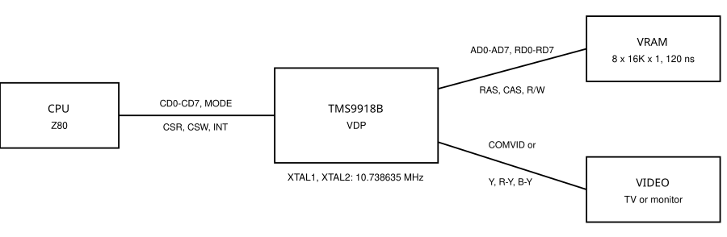
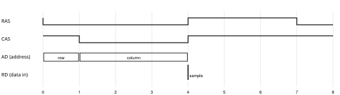
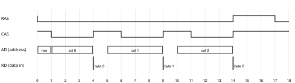
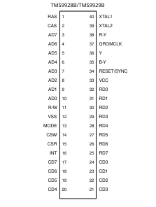
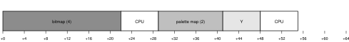
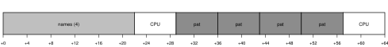

# TMS9918B/TMS9928B/TMS9929B Video Display Processors - Data Manual

**Team B Europe, TB-9918B-01, September 2026 - ADVANCE INFORMATION**

- Pin-for-pin replacement for the TMS9918A/TMS9928A/TMS9929A
- Same crystal, same 16K x 1 dynamic VRAM board (120 ns, page mode)
- Extended modes: 2 bpp tiles with palettes, bitmap, 64-column text
- Eight sprites per line, hardware scrolling, scanline interrupt

*Hypothetical 1983 device - design study prepared for the GearSF7000 emulator. Not a Texas Instruments product.*

*Copyright 2026 Saverio Russo - licensed under CC BY 4.0.*

**IMPORTANT NOTICES**

This manual describes the TMS9918B, TMS9928B and TMS9929B, a hypothetical revision of the Texas Instruments TMS9918A family developed as a design study. Every electrical and timing value marked as derived was computed from the data sheets of the dynamic RAMs fitted to 1983 Sega SC-3000 boards and from the TMS9918A/9928A/9929A Video Display Processors Data Manual (MP010A). Values not restated here are those of MP010A.

Copyright 2026 Saverio Russo. This document is licensed under the Creative Commons Attribution 4.0 International License (CC BY 4.0). Anyone may implement the device it describes, in hardware or software, and may copy and adapt the document, provided that credit is given. Implementations may call themselves TMS9918B compatible when they meet the conditions of COMPATIBILITY.md.

The design rationale, cost analysis and rejected alternatives are in the separate TMS9918B Design Notes. Programming examples are in the TMS9918B Programmer's Guide Supplement.

## Table of Contents

- [1. INTRODUCTION](#1-introduction) (1-1)
  - [1.1 Description](#11-description) (1-1)
  - [1.2 Features](#12-features) (1-1)
  - [1.3 Typical Applications](#13-typical-applications) (1-1)
  - [1.4 Acronyms and Glossary](#14-acronyms-and-glossary) (1-2)
- [2. ARCHITECTURE](#2-architecture) (2-1)
  - [2.1 CPU Interface](#21-cpu-interface) (2-1)
  - [2.2 Write-Only Registers](#22-write-only-registers) (2-1)
  - [2.3 Status Registers](#23-status-registers) (2-2)
  - [2.4 Palette](#24-palette) (2-2)
  - [2.5 Video Display Modes](#25-video-display-modes) (2-3)
  - [2.6 Sprites](#26-sprites) (2-4)
  - [2.7 Scrolling and Scanline Interrupt](#27-scrolling-and-scanline-interrupt) (2-4)
- [3. VDP INTERFACES AND OPERATION](#3-vdp-interfaces-and-operation) (3-1)
  - [3.1 VDP/VRAM Interface](#31-vdpvram-interface) (3-1)
  - [3.2 VRAM Memory Address Derivation](#32-vram-memory-address-derivation) (3-2)
  - [3.3 Monitor Interfaces](#33-monitor-interfaces) (3-3)
  - [3.4 External VDP Operation](#34-external-vdp-operation) (3-3)
  - [3.5 Oscillator and Clock Generation](#35-oscillator-and-clock-generation) (3-3)
  - [3.6 VDP Terminal Assignments](#36-vdp-terminal-assignments) (3-3)
- [4. DEVICE APPLICATIONS](#4-device-applications) (4-1)
  - [4.1 SC-3000 Class Systems](#41-sc-3000-class-systems) (4-1)
  - [4.2 Software Detection](#42-software-detection) (4-1)
  - [4.3 Initialization](#43-initialization) (4-1)
- [5. TMS9918B/9928B/9929B ELECTRICAL SPECIFICATIONS](#5-tms9918b9928b9929b-electrical-specifications) (5-1)
  - [5.1 Timing Requirements, VDP-VRAM Interface](#51-timing-requirements-vdp-vram-interface) (5-1)
  - [5.2 Switching Characteristics, VDP-VRAM Interface](#52-switching-characteristics-vdp-vram-interface) (5-1)
  - [5.3 CPU-VDP Interface](#53-cpu-vdp-interface) (5-1)
- [6. MECHANICAL DATA](#6-mechanical-data) (6-1)
- [APPENDIX A - CHOOSING VRAM MEMORY](#appendix-a---choosing-vram-memory) (A-1)
- [APPENDIX B - CPU TO VDP ACCESS TIMES](#appendix-b---cpu-to-vdp-access-times) (B-1)
- [APPENDIX C - MEMORY ACCESS SEQUENCES](#appendix-c---memory-access-sequences) (C-1)

## 1. INTRODUCTION

### 1.1 Description

The TMS9918B/9928B/9929B video display processors (VDP) are N-channel MOS LSI devices that generate all video, control and synchronization signals of a raster-scanned colour television or monitor and control the storage, retrieval and refresh of display data in a dynamic screen refresh memory. They are pin-for-pin replacements of the TMS9918A/9928A/9929A and use the same 10.738635 MHz crystal and the same eight 16K x 1 dynamic RAMs.

After reset the TMS9918B behaves as a TMS9918A: the same registers, the same four display modes and undocumented modes, the same VRAM access sequence and the same CPU access windows. Software unlocks the extended functions with a register command. The extended functions add a 16-entry palette of TMS colours with four luminance levels, six extended display modes, eight sprites per line with three-colour sprite pairs, hardware scrolling and a scanline interrupt.

The VDP reads VRAM with a memory cycle placed on half-periods of the crystal and fetches adjacent bytes in page mode. The extended functions therefore require dynamic RAMs with 120 ns access time and page-mode capability (Section 3.1 and Appendix A).

The TMS9928B/9929B are functionally identical to the TMS9918B except for the colour encoding, which is replaced by luminance and colour-difference outputs; the TMS9929B uses the 625-line format.

### 1.2 Features

- Pin-for-pin and software compatible with the TMS9918A/9928A/9929A
- Same crystal (10.738635 MHz) and same 16K x 1 dynamic VRAM (120 ns, page mode)
- 256 x 192 resolution; 512-pixel lines in 64-column text
- 15 TMS colours at 4 luminance levels through a 16-entry write-only palette
- Extended modes: Graphics1X (512 two-bit tiles), Graphics2Fat (16 colours per 2-pixel dot), linear Bitmap, Text 40 with colours per character, Text 64 with 768 characters
- Eight sprites per line, 512 sprite patterns, three-colour sprite pairs, tile priority over sprites
- Horizontal and vertical hardware scroll with left-column blanking and locked areas
- Scanline interrupt with programmable line count
- Faster CPU access: 14 to 18 T-states worst case in extended modes (29 T in Graphics mode)
- Standard 40-pin package

### 1.3 Typical Applications

- Home computers and video game consoles based on the TMS9918A family
- Colour terminals with 64-column text
- Home educational systems
- European 625-line TV (TMS9929B)



**FIGURE 1-1 - SYSTEM BLOCK DIAGRAM**

### 1.4 Acronyms and Glossary

| Term | Meaning |
|---|---|
| Unit | Half a period of the 10.738635 MHz crystal, 46.56 ns. Timing positions in this manual are given in units. |
| Slot | TMS9918A memory cycle position, 8 units (372 ns). 171 slots per line. |
| Burst | Page-mode memory cycle reading 2 to 4 adjacent bytes under one RAS pulse. |
| Extended mode | Display mode selected with MX = 1 after the unlock command (Section 2.5). |
| Palette entry | 6-bit value: TMS colour code and luminance level. |
| Stratum | One bit plane of a 2-bit-per-pixel pattern. |
| T-state | Z80 clock period at 3.58 MHz, 6 units. |
| VRAM | Video refresh memory, 16384 bytes of dynamic RAM. |

## 2. ARCHITECTURE

### 2.1 CPU Interface

The CPU interface is identical to the TMS9918A: an 8-bit bidirectional bus (CD0-CD7, CD0 is the MSB), MODE, CSR, CSW and INT. Bit 0 is the most significant bit throughout this manual, as in MP010A.

#### 2.1.1 Control port codes

A two-byte control transfer carries an address or a register value in the first byte and a code in the two most significant bits of the second byte.

| Second byte D0 D1 | TMS9918A | TMS9918B, XE = 0 | TMS9918B, XE = 1 |
|---|---|---|---|
| 0 0 | VRAM read address | VRAM read address | VRAM read address |
| 0 1 | VRAM write address | VRAM write address | VRAM write address |
| 1 0 | register write | register write | register write |
| 1 1 | register write | register write | palette write address (first byte D4-D7 = entry) |

**TABLE 2-1 - CONTROL PORT CODES**

#### 2.1.2 Register unlock

After reset the register number decodes three bits, as on the TMS9918A: register 8 aliases R0 and register 15 aliases R7. Two consecutive register writes of **5Ah** to register 63 (second byte **BFh**), without another register write in between, unlock registers 8 to 15. Only RESET locks them again. While locked the command lands in R7; software rewrites R7 afterwards.

> **NOTE**  
> Register 63 and the value 5Ah do not collide with the F18A/PICO9918 unlock (1Ch to register 57, which lands in R1 on a locked TMS9918B) nor with R15, the status register select of the V9938 and F18A.

#### 2.1.3 CPU access to VRAM

The 14-bit autoincrementing address register, the read-ahead byte and the transfer sequences are those of the TMS9918A. The VDP performs a CPU transfer in the next memory cycle reserved for the CPU; worst-case delays for every mode are listed in Appendix B.

#### 2.1.4 VDP interrupt

INT is active (low) when F = 1 and IE = 1 (frame interrupt, as on the TMS9918A) or when FL = 1 and IE1 = 1 (scanline interrupt, Section 2.7). Reading S0 clears F; reading S1 clears FL.

#### 2.1.5 VDP initialization

RESET clears R0, R1, R11 and R12, locks the extended registers and selects status register S0. The palette, R8-R10 and R13-R15 are undefined after power-up and must be written before extended modes are used.

### 2.2 Write-Only Registers

Registers R0 to R7 keep their TMS9918A functions (MP010A Section 2.2). Registers R8 to R15 exist after the unlock command. Figure 2-1 shows the extended registers; reserved bits must be written as 0.

**R8 H SCROLL** (D0 = MSB)

| Bits | Field |
|---|---|
| D0-D4 | COLUMNS |
| D5-D7 | FINE |

**R9 V SCROLL** (D0 = MSB)

| Bits | Field |
|---|---|
| D0-D7 | LINES (0-191) |

**R10 LINE COUNT** (D0 = MSB)

| Bits | Field |
|---|---|
| D0-D7 | RELOAD VALUE |

**R11 MODE** (D0 = MSB)

| Bits | Field |
|---|---|
| D0 | IE1 |
| D1 | 0 |
| D2 | 0 |
| D3 | 0 |
| D4 | 0 |
| D5 | 0 |
| D6 | MX |
| D7 | XE |

**R12 SCREEN** (D0 = MSB)

| Bits | Field |
|---|---|
| D0 | 0 |
| D1 | 0 |
| D2 | 0 |
| D3 | 0 |
| D4 | HLOCK |
| D5 | VLOCK |
| D6 | MASK |
| D7 | T64 |

**R13** (D0 = MSB)

| Bits | Field |
|---|---|
| D0-D7 | RESERVED |

**R14** (D0 = MSB)

| Bits | Field |
|---|---|
| D0-D7 | RESERVED |

**R15 STATUS SEL** (D0 = MSB)

| Bits | Field |
|---|---|
| D0 | 0 |
| D1 | 0 |
| D2 | 0 |
| D3 | 0 |
| D4-D7 | STATUS REGISTER NUMBER |

**FIGURE 2-1 - EXTENDED REGISTERS (D0 = MSB)**

| Register / bit | Function |
|---|---|
| R8 | World X = screen X + R8 (modulo 256). D0-D4 whole columns, D5-D7 pixels. Sampled once per line. |
| R9 | World line = (line + R9) modulo 192. Sampled once per line. |
| R10 | Scanline interrupt reload value (Section 2.7). |
| R11 D7 XE | Extended enable: palette port, S1, R8-R15 and IE1 become active. With XE = 0 the VDP is a TMS9918A. |
| R11 D6 MX | Extended display modes (requires XE). Selects the modes of Table 2-3 together with M1, M2, M3. |
| R11 D0 IE1 | Scanline interrupt enable. |
| R12 D7 T64 | Extended text modes use 64 columns instead of 40. |
| R12 D6 MASK | The leftmost 8 pixels show the backdrop colour, sprites included. |
| R12 D5 VLOCK | Columns 24-31 do not scroll vertically. |
| R12 D4 HLOCK | Lines 0-15 do not scroll horizontally. |
| R15 D4-D7 | Status register returned by a status read: 1 selects S1, any other value selects S0. |

**TABLE 2-2 - EXTENDED REGISTER FUNCTIONS**

> **NOTE**  
> In extended modes R3 is not used, R2 and R4 locate the extended tables (Section 3.2) and R7 supplies the backdrop colour and the text colours. R5 and R6 keep their TMS9918A meaning.

### 2.3 Status Registers

**S0** (D0 = MSB)

| Bits | Field |
|---|---|
| D0 | F |
| D1 | 5S |
| D2 | C |
| D3-D7 | SPRITE NUMBER |

**S1** (D0 = MSB)

| Bits | Field |
|---|---|
| D0 | 0 |
| D1 | 0 |
| D2 | 0 |
| D3 | 1 |
| D4 | 1 |
| D5 | 0 |
| D6 | 0 |
| D7 | FL |

**FIGURE 2-2 - STATUS REGISTERS**

S0 is the TMS9918A status register. In extended graphics modes 5S reports the ninth sprite found on a line pair (Section 2.6). S1 returns the identification value 18h plus FL (01h), the scanline interrupt flag, cleared when S1 is read. The identification fails the published detection masks of the F18A (111xxxxx), PICO9918 (E8h), V9938 and V9958, and reads as 18h when masked with 3Eh.

### 2.4 Palette

**ENTRY** (D0 = MSB)

| Bits | Field |
|---|---|
| D0 | 0 |
| D1 | 0 |
| D2-D3 | LUMINANCE |
| D4-D7 | TMS COLOUR CODE |

**FIGURE 2-3 - PALETTE ENTRY**

The palette holds 16 write-only entries on the chip: four palettes of four entries. The colour code selects one of the 15 TMS9918A colours; the luminance level scales the video output above black level: 00 full, 01 3/4, 10 1/2, 11 1/4. A palette write sets the entry number with control code 11 (Table 2-1); every following data port write stores one entry and increments the entry number modulo 16. Palette writes do not wait for a memory cycle.

Entry 0 of each palette is stored but never displayed: pixel value 0 shows the backdrop (R7 D4-D7) in playfield modes and is transparent for sprites.

### 2.5 Video Display Modes

| XE MX | M3 | M2 | M1 | Mode | Resolution | Sprites/line |
|---|---|---|---|---|---|---|
| 0 x or 1 0 | - | - | - | TMS9918A modes, documented and undocumented | - | 4 (Text: 0) |
| 1 1 | 0 | 0 | 0 | Graphics1X | 256 x 192, 32 x 24 tiles, 512 patterns, 2 bpp | 8 |
| 1 1 | 1 | 0 | 0 | Graphics2Fat | 128 x 192 (2-pixel dots), 768 patterns | 8 |
| 1 1 | 0 | 0 | 1 | Text40X / Text64 (T64 = 1) | 40 x 24 (6 x 8) / 64 x 24 (8 x 8) | cursor |
| 1 1 | 1 | 0 | 1 | Text40XQ / Text64Q | as above, up to 768 characters | cursor |
| 1 1 | 0 | 1 | 0 | Bitmap | 256 x 192, 2 bpp | 8 |
| 1 1 | 1 | 1 | 0 | BitmapQ | 256 x 192, 2 bpp, third banking | 8 |
| 1 1 | x | 1 | 1 | bars (as TMS9918A) | - | 0 |

**TABLE 2-3 - DISPLAY MODES (M1 = R1 D3, M2 = R1 D4, M3 = R0 D6)**

> **NOTE**  
> With XE = 0 or MX = 0 all eight M1-M2-M3 combinations behave as on the TMS9918A, including the undocumented Text 1Q (M1 + M3), Multicolor Q (M2 + M3) and bar modes (M1 + M2, M1 + M2 + M3), with the TMS9918A table addresses and memory access sequences: Text for M1 = 1, Multicolor for M2 = 1 and M1 = 0, Graphics otherwise.

M3 selects the third-banking variant of each extended mode: R4 D6-D7 give the middle and bottom thirds of the screen their own table blocks, as in Graphics II.

#### 2.5.1 Graphics1X Mode

Each of the 768 tile positions has a 2-byte name entry: the pattern name and an attribute. A pattern has 16 bytes, two for each of its eight rows (stratum 0, stratum 1). Pixel value = stratum 0 bit + 2 x stratum 1 bit; value 0 is the backdrop and values 1-3 are entries of the palette selected by the attribute.

**ATTRIBUTE** (D0 = MSB)

| Bits | Field |
|---|---|
| D0 | 0 |
| D1 | 0 |
| D2 | 0 |
| D3 | 0 |
| D4 | NAME8 |
| D5 | PRIOR |
| D6-D7 | PALETTE |

**FIGURE 2-4 - GRAPHICS1X ATTRIBUTE**

NAME8 is the ninth bit of the pattern name (512 patterns). PRIOR places the non-backdrop pixels of the tile in front of all sprites.

#### 2.5.2 Graphics2Fat Mode

The name entry and the 16-byte pattern layout are those of Graphics1X, with third banking (768 patterns) and the attribute PRIOR bit only. Each pattern row describes four dots, each two pixels wide: dot p takes bits (2p, 2p+1) of stratum 0 as its low bits and the same bits of stratum 1 as its high bits (D0 = MSB). The 4-bit value is a TMS colour code at full luminance; 0 is the backdrop.

#### 2.5.3 Bitmap and BitmapQ Modes

The bitmap stores two bytes (stratum 0, stratum 1) for every 8 pixels of every line: 64 bytes per line, 12288 bytes for the screen. A palette map holds one byte for every 8 x 8 area; its D6-D7 select the palette of the area. In BitmapQ each third of the screen uses a 4096-byte block selected as in Graphics II.

#### 2.5.4 Text40X and Text64 Modes

Text40X keeps the 40 x 24 layout of Text mode with a 2-byte entry per character: the pattern name and a colour byte whose D0-D3 give the foreground and D4-D7 the background; a zero nibble uses the corresponding nibble of R7, so a colour byte of 00h displays exactly as Text mode.

With T64 = 1 the VDP displays 64 x 24 characters of 8 x 8 pixels on 512-pixel lines (one name byte per character, all 8 pattern bits used). The two colours of the whole screen come from R7. Monitors with RGB or component input are required for legible 64-column text.

In both text modes sprites 0 and 1 are displayed as a hardware cursor (a pair when sprite 1 has PAIR set); in 64-column text the sprite X coordinate is doubled.

### 2.6 Sprites

The Sprite Attribute Table and Sprite Pattern Table keep the TMS9918A layout. In extended graphics modes the fourth attribute byte has the format of Figure 2-5 and up to eight sprites are displayed per line.

**COLOUR BYTE** (D0 = MSB)

| Bits | Field |
|---|---|
| D0 | EC |
| D1 | 0 |
| D2 | BANK |
| D3 | PAIR |
| D4-D5 | PALETTE |
| D6-D7 | ENTRY |

**FIGURE 2-5 - SPRITE ATTRIBUTE BYTE 3 IN EXTENDED MODES**

| Field | Function |
|---|---|
| EC | Early clock: X - 32, as TMS9918A. |
| BANK | Pattern taken from the 2048-byte table that follows the one located by R6. |
| PAIR | Odd sprites only: sprite 2k+1 becomes the second bit plane of sprite 2k. |
| PALETTE, ENTRY | Single sprite colour: entry 1-3 of the palette; entry 0 makes the sprite invisible (it still takes part in coincidence). |
| Pair colour | Pixel value = bit of sprite 2k + 2 x bit of sprite 2k+1, using entries 1-3 of the palette of sprite 2k; the palette and entry fields of sprite 2k+1 are ignored. |

**TABLE 2-4 - SPRITE COLOUR BYTE FIELDS**

Both sprites of a pair keep their own position, name and pattern; the combined value exists where their pixels overlap. Their overlap does not set the coincidence flag C; overlaps with other sprites do. Priority is the priority of sprite 2k.

Sprite selection is evaluated over line pairs: the vertical positions of sprites 0-15 are compared during even lines and those of sprites 16-31 during odd lines, and the selection is used for the next two lines. The eight-sprite limit applies to the sprites visible on either line of the pair; 5S and the sprite number in S0 report the ninth.

### 2.7 Scrolling and Scanline Interrupt

R8 and R9 scroll Graphics1X, Graphics2Fat, Bitmap and BitmapQ; R9 also scrolls the text modes. The memory access sequence does not change: the fetched tile column is (c + 1 + R8/8) modulo 32 and the fine scroll selects the output tap of the pixel shift register. MASK blanks the first 8 pixels so that 32 fetched columns cover the visible picture for every fine scroll value. The world line selects name row, pattern row and third together.

Both scroll registers are sampled once per line, at the first background access of that line. A value written later takes effect on the next line, on both axes: a cell can never take its name from one world position and its pattern from another, and a scanline interrupt can change either register for the lines that follow.

The line counter is loaded from R10 at the first active line and whenever R10 is written. It is decremented at the end of every active line 0-191; when it would become negative, FL is set and the counter is reloaded. R10 = 0 interrupts on every line; R10 = n interrupts every n+1 lines.

## 3. VDP INTERFACES AND OPERATION

### 3.1 VDP/VRAM Interface

The VRAM interface uses the TMS9918A terminals: AD0-AD7 (address and write data, AD0 = MSB), RD0-RD7 (read data), RAS, CAS and R/W, connected to eight 16K x 1 dynamic RAMs as described in MP010A Table 3-1.

#### 3.1.1 VRAM Memory Types

The TMS9918B requires 16K x 1 dynamic RAMs with 120 ns row access time, 270 ns cycle time and page-mode operation, single +5 V types included. Examples: Fujitsu MB8118-12, Motorola MCM4517-12. 150 ns types do not meet the data setup requirement in any mode. R1 D0 (4/16K) must be 1. Appendix A gives the selection equations.

#### 3.1.2 Address Multiplexing

A0-A6 (the most significant address bits) are output with RAS as row address and A7-A13 with CAS as column address. A page-mode cycle keeps the row and changes only the column, so its bytes lie in one 128-byte page; every table layout of Section 3.2 starts its multi-byte fetches at a multiple of the fetch length from a base that is a multiple of 128.

#### 3.1.3 Memory Cycles

Every memory cycle reads or writes 1 to 4 bytes under one RAS pulse. Edges are placed on half-periods of the crystal (units of 46.56 ns). An n-byte cycle lasts 5n + 2 units:

| Signal | Timing (units from RAS falling edge) |
|---|---|
| RAS | low from 0 to 5n - 1, precharge 3 units |
| CAS, byte k | low from 1 + 5k to 4 + 5k; RD0-RD7 are latched on the rising edge |
| R/W (write, n = 1) | low from 2 to 4 (late write); AD0-AD7 carry the column address at the CAS falling edge, then the data, latched by the RAM on the R/W falling edge |
| Length | 1 byte 7 units (326 ns), 2 bytes 12, 3 bytes 17, 4 bytes 22 |

**TABLE 3-1 - MEMORY CYCLE STRUCTURE**



**FIGURE 3-1 - SINGLE-BYTE READ CYCLE**



**FIGURE 3-2 - THREE-BYTE PAGE-MODE READ CYCLE**


**FIGURE 3-3 - WRITE CYCLE**

#### 3.1.4 Memory Access Sequence

In TMS9918A modes the VDP runs a single-byte cycle at the start of every TMS9918A slot followed by one idle unit, so the positions of the CPU access windows equal those of the TMS9918A. In extended modes each line follows one of the sequences of Appendix C. The positions refer to phase 0 of the line: unit = 2 x phase; TMS9918A slot s starts at unit (8s + 1364) modulo 1368.

### 3.2 VRAM Memory Address Derivation

| Table | Mode | Address of the first byte fetched | Bytes |
|---|---|---|---|
| Name entry | Graphics1X, Graphics2Fat | (R2) x 400h + 2 x (row x 32 + column) | 2 |
| Pattern row | Graphics1X | (R4) x 800h + 16 x name9 + 2 x row | 2 |
| Pattern row | Graphics2Fat | (R4 D5) x 2000h + 16 x (third x 100h + name AND mask) + 2 x row | 2 |
| Bitmap | Bitmap | (R4) x 800h + 64 x line + 4 x (column pair) | 4 |
| Bitmap | BitmapQ | (R4 D5) x 2000h + 1000h x block + 64 x (line AND 63) + 4 x (column pair) | 4 |
| Palette map | Bitmap, BitmapQ | (R2) x 400h + 32 x row + 2 x (column pair) | 2 |
| Character entry | Text40X | (R2) x 400h + 4 x (row x 20 + column pair) | 4 |
| Name | Text64 | (R2) x 400h + 64 x row + 4 x (column group) | 4 |
| Pattern | text modes | (R4) x 800h + 8 x name + row (TMS layout; thirds with M3) | 1 |
| Sprite X, name, colour | extended graphics | (R5) x 80h + 4 x sprite + 1 | 3 |
| Sprite Y | all | (R5) x 80h + 4 x sprite | 1 |
| Sprite pattern | all | (R6) x 800h + (BANK) x 800h + 8 x name + row (+16 right half) | 1 |

**TABLE 3-2 - EXTENDED MODE ADDRESS DERIVATION**

Row, column, line and third refer to the world position after scrolling. In Graphics2Fat the mask is (R4 D6 D7) x 100h + FFh; in BitmapQ block t of the middle or bottom third is used when the corresponding R4 bit is 1, otherwise block 0. Addresses are modulo 4000h.

| Mode | Tables (bytes) | Total |
|---|---|---|
| Graphics1X | patterns 8192, sprite patterns with BANK 4096, names 1536, SAT 128 | 13952 |
| Graphics2Fat | patterns 12288, sprite patterns 2048, names 1536, SAT 128 | 16000 |
| Bitmap, BitmapQ | bitmap 12288, sprite patterns 2048, palette map 768, SAT 128 | 15232 |
| Text40X | patterns 2048, cursor patterns 256, entries 1920, SAT 128 | 4352 |
| Text64 | patterns 2048, cursor patterns 256, names 1536, SAT 128 | 3968 |

**TABLE 3-3 - VRAM REQUIREMENTS OF THE EXTENDED MODES**

### 3.3 Monitor Interfaces

The composite video output of the TMS9918B and the Y, R-Y and B-Y outputs of the TMS9928B/9929B have the levels and loads of MP010A Section 3.4. Luminance levels below full scale reduce luminance and colour difference in the same ratio above black level.

### 3.4 External VDP Operation

External VDP operation of the TMS9918B (EXTVDP, R0 D7) is that of the TMS9918A.

### 3.5 Oscillator and Clock Generation

The VDP uses a 10.738635 MHz crystal on XTAL1/XTAL2 or an external two-phase clock with the MP010A Section 5.4 limits (high and low pulse widths 42-52 ns, 42-52 ns phase delay from XTAL1 to XTAL2). Both clock phases time the memory cycle edges. CPUCLK (fext / 3) and GROMCLK (fext / 24) are unchanged.

### 3.6 VDP Terminal Assignments




**FIGURE 3-4 - TERMINAL ASSIGNMENTS (IDENTICAL TO THE TMS9918A/9928A/9929A)**

## 4. DEVICE APPLICATIONS

### 4.1 SC-3000 Class Systems

The TMS9918B replaces the TMS9918A or TMS9929A of an SC-3000 class system without board changes when the fitted VRAM meets Section 3.1.1. Boards produced in 1983 carry, among others, Fujitsu MB8118-12 (qualified) and Motorola MCM4517P15 (not qualified for the TMS9918B) dynamic RAMs. A board with 150 ns VRAM needs eight 120 ns page-mode RAMs in the same positions.

| VDP terminal | Connected to |
|---|---|
| AD0 | D input of RAM 0 (data only) |
| AD1 ... AD7 | A6 ... A0 of all RAMs, and D input of RAM 1 ... RAM 7 |
| RD0 ... RD7 | Q output of RAM 0 ... RAM 7 |
| RAS, CAS, R/W | RAS, CAS, WE of all RAMs |

**TABLE 4-1 - VDP TO VRAM CONNECTIONS (AS TMS9918A, MP010A TABLE 3-1)**

### 4.2 Software Detection

Recommended detection sequence: (1) run F18A/PICO9918 detection first if supported; (2) write 5Ah twice to register 63 and restore R7; (3) write 01h to R11 (XE, bit D7; lands in R3 on other devices, restore R3); (4) write 01h to R15, read the status port twice and compare the second value AND 3Eh with 18h; (5) write 00h to R15 and restore R3 and R7.

### 4.3 Initialization

Extended modes are selected by writing XE and MX in R11, M1-M3 in R0/R1 and the table bases in R2, R4, R5 and R6, and by loading the palette. Register values, memory maps and example programs for every mode are given in the TMS9918B Programmer's Guide Supplement.

## 5. TMS9918B/9928B/9929B ELECTRICAL SPECIFICATIONS

Absolute maximum ratings, recommended operating conditions, electrical characteristics, CPU-VDP timing requirements and switching characteristics, video output characteristics and external clock requirements are those of the TMS9918A/9928A/9929A (MP010A Sections 5.1 to 5.5) unless listed below. Supply current is higher than the TMS9918A because of the added logic; its limits are to be determined.

### 5.1 Timing Requirements, VDP-VRAM Interface

| Parameter | Description | MIN | NOM | MAX | Unit |
|---|---|---|---|---|---|
| tsu(D-CH) | RD0-RD7 setup time before CAS high | 40 |  |  | ns |
| th(CH-D) | RD0-RD7 hold time after CAS high | 0 |  |  | ns |
| ta(R) | VRAM access time from RAS (Appendix A) |  |  | 120 | ns |
| ta(C) | VRAM access time from CAS (Appendix A) |  |  | 65 | ns |

**TABLE 5-1 - VDP-VRAM TIMING REQUIREMENTS**

### 5.2 Switching Characteristics, VDP-VRAM Interface

| Parameter | Description | MIN | NOM | MAX | Unit |
|---|---|---|---|---|---|
| tc(1) | Memory cycle time, one byte (7 units) | 321 | 326 | 331 | ns |
| tc(P) | Page-mode byte period, CAS low to CAS low (5 units) | 228 | 233 | 238 | ns |
| tw(RL) | RAS low, one byte (4 units) | 181 | 186 | 191 | ns |
| tw(RL)n | RAS low, n bytes (5n - 1 units) |  | 46.56 x (5n-1) |  | ns |
| tw(RH) | RAS precharge (3 units) | 135 | 140 | 145 | ns |
| td(RL-CL) | RAS low to CAS low (1 unit) | 42 | 47 | 52 | ns |
| tw(CL) | CAS low (3 units) | 135 | 140 | 145 | ns |
| tw(CH)P | CAS high inside a page-mode cycle (2 units) | 88 | 93 | 98 | ns |
| tw(CH) | CAS high between cycles (4 units) | 181 | 186 | 191 | ns |
| th(RL-RA) | Row address hold after RAS low | 20 |  |  | ns |
| tsu(CA-CL) | Column address setup before CAS low | 0 |  |  | ns |
| th(CH-CA) | Column address hold after CAS high | 5 |  |  | ns |
| tw(W) | R/W low, write cycle (4 units) | 181 | 186 | 191 | ns |
| tsu(D-WL) | Write data setup before R/W low | 0 |  |  | ns |
| th(RH-D) | Write data hold after RAS high | 5 |  |  | ns |

**TABLE 5-2 - VDP-VRAM SWITCHING CHARACTERISTICS (CL = 50 pF)**

> **NOTE**  
> Nominal values assume a 50 % clock duty cycle. MIN and MAX of odd unit counts follow the 42-52 ns clock phase limits; even unit counts equal whole clock periods.

### 5.3 CPU-VDP Interface

CPU-VDP timing requirements and switching characteristics are those of MP010A. Memory access delays are listed in Appendix B; palette and register writes are not delayed by memory cycles.

## 6. MECHANICAL DATA

The TMS9918B/9928B/9929B use the 40-pin plastic dual-in-line package of the TMS9918A/9928A/9929A (MP010A Section 6.1).

## APPENDIX A - CHOOSING VRAM MEMORY

The VDP latches RD0-RD7 on the rising edge of CAS. The first byte of a cycle is latched 4 units (186.2 ns) after the falling edge of RAS; a following byte of a page-mode cycle is latched 3 units (139.7 ns) after the falling edge of its CAS. With td(RAS) and td(data) the board delays of the strobe and of the data:

```
186.2 ns >= max[ta(R), 46.6 ns + ta(C)] + td(RAS) + td(data) + tsu(D-CH)
```

```
139.7 ns >= ta(C) + td(CAS) + td(data) + tsu(D-CH)
```

With tsu(D-CH) = 40 ns the memories of Table A-1 allow the listed board delay. All other memory limits (cycle time, RAS and CAS pulse widths, precharge, page-mode timing, write timing) are met with the margins of Table A-2.

| Part | ta(R) | ta(C) | Board delay allowed (first byte) | Board delay allowed (page byte) | Result |
|---|---|---|---|---|---|
| Fujitsu MB8118-12 | 120 ns | 65 ns | 26 ns | 35 ns | qualified |
| Motorola MCM4517-12 | 120 ns | 65 ns | 26 ns | 35 ns | qualified |
| Motorola MCM4517-15 | 150 ns | 80 ns | -4 ns | 20 ns | not qualified |
| TI TMS4116-20 | 200 ns | 135 ns | -54 ns | - | not qualified |

**TABLE A-1 - VRAM ACCESS TIME BUDGET**

| Parameter (MB8118-12 limit) | VDP provides | Margin |
|---|---|---|
| tRC 270 ns | 326 ns | 56 ns |
| tRAS 140 ns | 186 ns | 46 ns |
| tRP 120 ns | 140 ns | 20 ns |
| tRCD 25-55 ns | 47 ns | within |
| tCAS 65 ns | 140 ns | 75 ns |
| tCSH 120 ns | 186 ns | 66 ns |
| tRSH 85 ns | 140 ns | 55 ns |
| tCPN 55 ns | 186 ns | 131 ns |
| tCP 70 ns | 93 ns | 23 ns |
| tPC 145 ns | 233 ns | 88 ns |
| tWP 35 ns | 93 ns | 58 ns |
| tRWL 65 ns | 93 ns | 28 ns |
| tCWL 50 ns | 93 ns | 43 ns |
| tWCR 90 ns | 186 ns | 96 ns |
| tDH 35 ns | 93 ns | 58 ns |

**TABLE A-2 - MEMORY LIMITS AND MARGINS (NOMINAL CLOCK)**

## APPENDIX B - CPU TO VDP ACCESS TIMES

| Condition | Mode | VDP delay | Time waiting for an access window | Total time | T-states @ 3.58 MHz |
|---|---|---|---|---|---|
| Active display area | Text (TMS) | 2 us | 0 - 1.1 us | 2 - 3.2 us | 12 |
| Active display area | Graphics I, II (TMS) | 2 us | 0 - 6.0 us | 2 - 8.0 us | 29 |
| Active display area | Multicolor (TMS) | 2 us | 0 - 1.5 us | 2 - 3.5 us | 13 |
| Any time | Graphics1X, Graphics2Fat | 2 us | 0 - 3.0 us | 2 - 5.0 us | 18 |
| Any time | Bitmap, BitmapQ | 2 us | 0 - 1.9 us | 2 - 4.0 us | 15 |
| Any time | Text40X, Text40XQ | 2 us | 0 - 2.2 us | 2 - 4.3 us | 16 |
| Any time | Text64, Text64Q | 2 us | 0 - 1.6 us | 2 - 3.7 us | 14 |
| 4300 us after vertical interrupt | All | 2 us | 0 us | 2 us | 8 |
| Register 1 blank bit 0 | All | 2 us | 0 us | 2 us | 8 |

**TABLE B-1 - CPU TO VDP ACCESS TIMES**

A continuous write loop never loses data when its period is at least the total time of the mode. In Bitmap, Text40X and Text64 modes an OUTI chain (16 T-states) is loss-free; in Graphics1X and Graphics2Fat an OTIR (21 T-states per byte) is loss-free.

## APPENDIX C - MEMORY ACCESS SEQUENCES

Offsets are in units (46.56 ns) from the first unit of a group; figures in parentheses are bytes fetched. The complete position of every cycle of every line is listed in the TMS9918B model report (calendars.md).

#### C.1 Graphics1X and Graphics2Fat - two cells per 64 units from unit 212


**FIGURE C-1 - TILE MODE CELL PAIR**

#### C.2 Bitmap and BitmapQ - two cells per 64 units from unit 212



**FIGURE C-2 - BITMAP MODE CELL PAIR**

#### C.3 Text40X - two characters per 48 units from unit 236


**FIGURE C-3 - TEXT40X CHARACTER PAIR**

#### C.4 Text64 - four characters per 64 units from unit 212



**FIGURE C-4 - TEXT64 CHARACTER GROUP**

#### C.5 Horizontal blanking of the extended graphics modes (units 1236-1579)

One CPU cycle; four groups of two sprites a, b of 76 units: sprite X, name and colour of a (3), of b (3), CPU, left half a, right half a, left half b, right half b, CPU; four CPU cycles. Text modes fetch the cursor sprites 0 and 1 in the same way and use the rest of the blanking for CPU cycles.

| Sequence | CPU cycles per line | Sprites per line | Worst CPU delay |
|---|---|---|---|
| Graphics1X, Graphics2Fat | 29 | 8 | 18 T |
| Bitmap, BitmapQ | 45 | 8 | 15 T |
| Text40X | 67 | cursor | 16 T |
| Text64 | 70 | cursor | 14 T |

**TABLE C-1 - SEQUENCE SUMMARY**
