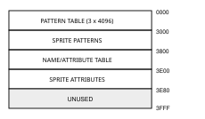
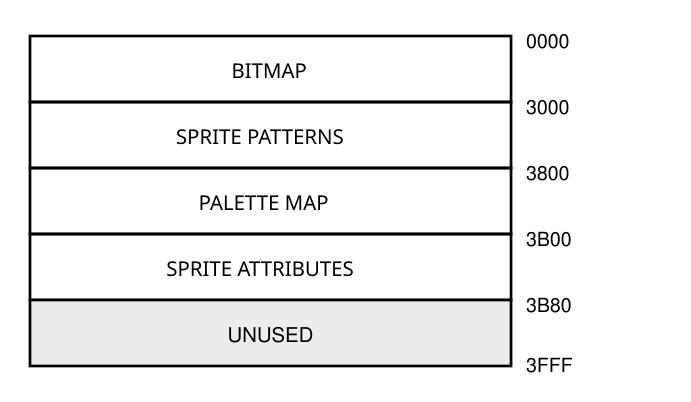
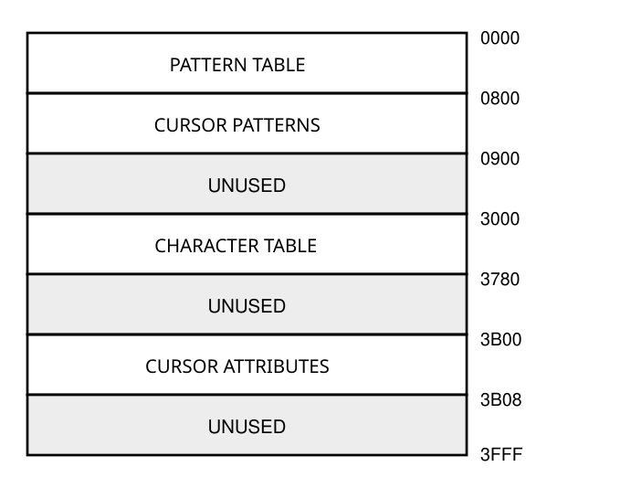

# Video Display Processors - TMS9918B Programmer's Guide Supplement

**Team B Europe, TB-9918B-02, September 2026 - ADVANCE INFORMATION**

*Hypothetical 1983 device - design study prepared for the GearSF7000 emulator. Not a Texas Instruments product. Companion to the TMS9918B Data Manual (TB-9918B-01).*

*Copyright 2026 Saverio Russo - licensed under CC BY 4.0. The example programs may also be used under Apache-2.0.*

**IMPORTANT NOTICE**

This supplement describes the programming of the TMS9918B, a hypothetical revision of the TMS9918A developed as a design study. It assumes the reader knows the Video Display Processors Programmer's Guide (SPPU004) and covers only what the TMS9918B adds. Electrical and timing data are in the TMS9918B Data Manual.

Copyright 2026 Saverio Russo. This document is licensed under the Creative Commons Attribution 4.0 International License (CC BY 4.0). Anyone may implement the device it describes, in hardware or software, and may copy and adapt the document, provided that credit is given. Implementations may call themselves TMS9918B compatible when they meet the conditions of COMPATIBILITY.md.

Bit 0 is the MSB and bit 7 the LSB, as in SPPU004. Z80 examples use the SC-3000 ports: data BEh (MODE = 0) and control BFh (MODE = 1). The example programs may also be used under the Apache License 2.0.

## Table of Contents

- [1. INTRODUCTION](#1-introduction) (1-1)
  - [1.1 General TMS9918B Operation](#11-general-tms9918b-operation) (1-1)
  - [1.2 Reference Material](#12-reference-material) (1-1)
- [2. FEATURES](#2-features) (2-1)
  - [2.1 Display Planes](#21-display-planes) (2-1)
  - [2.2 Extended Display Modes](#22-extended-display-modes) (2-1)
  - [2.3 Available Colours](#23-available-colours) (2-1)
  - [2.4 Palettes](#24-palettes) (2-1)
- [3. TALKING TO THE TMS9918B](#3-talking-to-the-tms9918b) (3-1)
  - [3.1 Unlocking the Extended Registers](#31-unlocking-the-extended-registers) (3-1)
  - [3.2 Detecting the TMS9918B](#32-detecting-the-tms9918b) (3-1)
  - [3.3 Writing the Palette](#33-writing-the-palette) (3-2)
  - [3.4 Reading the Status Registers](#34-reading-the-status-registers) (3-2)
- [4. DESCRIPTION OF THE EXTENDED REGISTERS](#4-description-of-the-extended-registers) (4-1)
  - [4.1 Extended Write-Only Registers](#41-extended-write-only-registers) (4-1)
  - [4.2 Status Register S1](#42-status-register-s1) (4-2)
- [5. INITIALIZING THE EXTENDED MODES](#5-initializing-the-extended-modes) (5-1)
  - [5.1 Graphics1X Mode Initialization](#51-graphics1x-mode-initialization) (5-1)
  - [5.2 Graphics2Fat Mode Initialization](#52-graphics2fat-mode-initialization) (5-1)
  - [5.3 Bitmap Mode Initialization](#53-bitmap-mode-initialization) (5-2)
  - [5.4 Text40X and Text64 Mode Initialization](#54-text40x-and-text64-mode-initialization) (5-3)
- [6. CREATING PATTERNS FOR EXTENDED MODES](#6-creating-patterns-for-extended-modes) (6-1)
  - [6.1 Two-Bit Tile Patterns](#61-two-bit-tile-patterns) (6-1)
  - [6.2 Graphics2Fat Patterns](#62-graphics2fat-patterns) (6-1)
  - [6.3 Text Patterns](#63-text-patterns) (6-1)
- [7. THE EXTENDED DISPLAY MODES](#7-the-extended-display-modes) (7-1)
  - [7.1 Graphics1X Mode](#71-graphics1x-mode) (7-1)
  - [7.2 Graphics2Fat Mode](#72-graphics2fat-mode) (7-1)
  - [7.3 Bitmap and BitmapQ Modes](#73-bitmap-and-bitmapq-modes) (7-1)
  - [7.4 Text40X Mode](#74-text40x-mode) (7-1)
  - [7.5 Text64 Mode](#75-text64-mode) (7-1)
- [8. SPRITES IN EXTENDED MODES](#8-sprites-in-extended-modes) (8-1)
  - [8.1 Sprite Colour](#81-sprite-colour) (8-1)
  - [8.2 BANK](#82-bank) (8-1)
  - [8.3 Sprite Pairs](#83-sprite-pairs) (8-1)
  - [8.4 Sprites per Line](#84-sprites-per-line) (8-1)
  - [8.5 Hardware Cursor](#85-hardware-cursor) (8-1)
- [9. PROGRAMMING TIPS](#9-programming-tips) (9-1)
  - [9.1 Hardware Scrolling](#91-hardware-scrolling) (9-1)
  - [9.2 Scanline Interrupts](#92-scanline-interrupts) (9-1)
  - [9.3 Palette Effects](#93-palette-effects) (9-2)
  - [9.4 Loading VRAM Quickly](#94-loading-vram-quickly) (9-2)
- [APPENDIX A - EXTENDED REGISTER QUICK REFERENCE](#appendix-a---extended-register-quick-reference) (A-1)
- [APPENDIX B - CPU TO VDP ACCESS TIMES](#appendix-b---cpu-to-vdp-access-times) (B-1)
- [APPENDIX C - ADDRESS LOCATION TABLES](#appendix-c---address-location-tables) (C-1)
- [APPENDIX D - Z80 SUPPORT ROUTINES](#appendix-d---z80-support-routines) (D-1)

## 1. INTRODUCTION

This is a supplement to the TI Video Display Processors Programmer's Guide. Everything that guide says about the TMS9918A remains true for the TMS9918B: the same ports, registers, tables and display modes are available after power-up, and existing software runs unchanged. This supplement explains how to unlock and use the extended functions: palettes, extended display modes, eight sprites per line with sprite pairs, hardware scrolling and the scanline interrupt.

The programming examples are written in Z80 assembly language for SC-3000 class systems. The routines of Appendix D are used by all examples.

### 1.1 General TMS9918B Operation

The TMS9918B fetches data from VRAM, processes it into a serial stream of pixels and gives the CPU access to its registers and to VRAM between fetches, exactly like the TMS9918A. The difference is inside the loop: memory cycles are shorter, adjacent bytes are fetched together, and in extended modes the VDP fetches two-byte entries (for example a pattern name and its attribute) in a single memory cycle. For the programmer this means that extended tables are made of byte pairs or groups stored next to each other.

### 1.2 Reference Material

| Document | Content |
|---|---|
| TMS9918A/28A/29A Video Display Processors Data Manual (MP010A) | TMS9918A hardware |
| Video Display Processors Programmer's Guide (SPPU004) | TMS9918A programming |
| TMS9918B/9928B/9929B Data Manual (TB-9918B-01) | TMS9918B hardware and timing |
| TMS9918B Design Notes | Design rationale and history |

## 2. FEATURES

### 2.1 Display Planes

The 35 display planes of the TMS9918A remain: 32 sprite planes, the pattern plane, the backdrop and the external VDP plane. In Graphics1X and Graphics2Fat a tile can be placed in front of the sprite planes with its PRIOR attribute bit; the backdrop still shows where the tile pixel value is 0.

### 2.2 Extended Display Modes

| Mode | Screen | Colours | Sprites/line | Typical use |
|---|---|---|---|---|
| Graphics1X | 32 x 24 tiles, 512 patterns | 3 + backdrop per tile, 4 palettes | 8 | games with scrolling playfields |
| Graphics2Fat | 128 x 192 dots, 768 patterns | 15 per dot | 8 | title screens, drawing programs |
| Bitmap / BitmapQ | 256 x 192 pixels | 3 + backdrop per 8 x 8 area | 8 | logos, plotting, scrolling pictures |
| Text40X | 40 x 24, 6 x 8 characters | foreground/background per character | cursor | colour text screens |
| Text64 | 64 x 24, 8 x 8 characters, 768 with thirds | 2 for the screen | cursor | terminals, editors, BASIC |

**TABLE 2-1 - EXTENDED DISPLAY MODES**

### 2.3 Available Colours

The TMS9918B displays the 15 TMS9918A colours (SPPU004 Table 2-1). In extended modes each colour can be shown at four luminance levels through the palette, for up to 57 distinct colours; black stays black at every level.

| Luminance bits (D2 D3) | Value | Output level above black |
|---|---|---|
| 0 0 | 00h | full |
| 0 1 | 10h | 3/4 |
| 1 0 | 20h | 1/2 |
| 1 1 | 30h | 1/4 |

**TABLE 2-2 - LUMINANCE LEVELS**

### 2.4 Palettes

The palette has 16 entries: four palettes of four entries. A palette entry is one byte: luminance value (Table 2-2) plus the TMS colour number. Tiles, bitmap areas and sprites select one of the four palettes; their pixel values 1, 2 and 3 select the entries. Entry 0 of each palette is never displayed: pixel value 0 is the backdrop colour of R7 for tiles and bitmaps, and transparent for sprites. Graphics2Fat and the text modes do not use the palette.

| Entry | Palette 0 | Palette 1 | Palette 2 | Palette 3 |
|---|---|---|---|---|
| Entries | 0-3 | 4-7 | 8-11 | 12-15 |

**TABLE 2-3 - PALETTE ENTRY NUMBERS**

## 3. TALKING TO THE TMS9918B

All TMS9918A transfers of SPPU004 Section 4 remain valid. The TMS9918B adds three operations: the unlock command, palette writes and status register selection.

### 3.1 Unlocking the Extended Registers

After power-up the TMS9918B decodes register numbers like the TMS9918A (0 to 7). The unlock command is two consecutive writes of 5Ah to register 63. Both writes land in R7, so R7 must be written again afterwards.

| Operation | MSB 0 | 1 | 2 | 3 | 4 | 5 | 6 | LSB 7 | Hex | MODE |
|---|---|---|---|---|---|---|---|---|---|---|
| Data write (byte 1) | 0 | 1 | 0 | 1 | 1 | 0 | 1 | 0 | 5A | 1 |
| Register select (byte 2) | 1 | 0 | 1 | 1 | 1 | 1 | 1 | 1 | BF | 1 |
| Data write (byte 3) | 0 | 1 | 0 | 1 | 1 | 0 | 1 | 0 | 5A | 1 |
| Register select (byte 4) | 1 | 0 | 1 | 1 | 1 | 1 | 1 | 1 | BF | 1 |

**TABLE 3-1 - UNLOCK COMMAND**

> **NOTE**  
> Once unlocked, register numbers 8 to 15 address the extended registers. Only a hardware RESET locks them again.

### 3.2 Detecting the TMS9918B

A program that uses extended functions must first verify the VDP. The sequence below is harmless on a TMS9918A, TMS9118, V9938 or F18A: every write that could land in another register is undone. Run it with interrupts disabled, because it reads the status register.

- Unlock (Section 3.1) and restore R7.
- Write 01h to R8 (XE). On other devices this lands in R0: restore R0.
- Write 01h to R15 to select S1. On other devices this lands in R7.
- Read the status port twice. On a TMS9918B the second value AND 3Eh equals 18h.
- Write 00h to R15 to select S0 again, then restore R0 and R7.

**EXAMPLE 3-1. Detecting the TMS9918B**

```
DETECT: DI
        CALL UNLOCK        ; two writes of 5AH to register 63
        LD   A,01H         ; XE
        LD   B,8
        CALL WRREG
        LD   A,01H         ; select S1
        LD   B,15
        CALL WRREG
        IN   A,(VDPCTL)
        IN   A,(VDPCTL)    ; second read
        AND  3EH
        LD   C,A
        XOR  A             ; select S0
        LD   B,15
        CALL WRREG
        LD   A,(SHADOW0)   ; restore R0 and R7
        LD   B,0
        CALL WRREG
        LD   A,(SHADOW7)
        LD   B,7
        CALL WRREG
        LD   A,C
        CP   18H           ; Z = TMS9918B present
        EI
        RET
```

### 3.3 Writing the Palette

With XE = 1, code 11 in the two most significant bits of the second control byte selects the palette. The first byte gives the entry number (0-15); every following write to the data port stores one entry and advances the entry number. The palette cannot be read back.

| Operation | MSB 0 | 1 | 2 | 3 | 4 | 5 | 6 | LSB 7 | MODE |
|---|---|---|---|---|---|---|---|---|---|
| Entry number (byte 1) | 0 | 0 | 0 | 0 | E | E | E | E | 1 |
| Palette select (byte 2) | 1 | 1 | 0 | 0 | 0 | 0 | 0 | 0 | 1 |
| Entry data (byte 3, 4 ...) | 0 | 0 | L | L | C | C | C | C | 0 |

**TABLE 3-2 - WRITE TO PALETTE (E = ENTRY, L = LUMINANCE, C = COLOUR)**

**EXAMPLE 3-2. Loading all 16 entries**

```
LOADPAL:                   ; HL -> 16 palette bytes
        XOR  A
        OUT  (VDPCTL),A    ; entry 0
        LD   A,0C0H
        OUT  (VDPCTL),A    ; code 11: palette
        LD   BC,1000H+VDPDAT
        OTIR               ; palette writes never wait for VRAM
        RET

PALETTE:                   ; palette 0: -, white, grey, dark blue
        DB   00H,0FH,0EH,04H
        DB   00H,0BH,1BH,2BH ; palette 1: light yellow at full, 3/4, 1/2
        DB   00H,08H,09H,06H ; palette 2: reds
        DB   00H,03H,02H,0CH ; palette 3: greens
```

### 3.4 Reading the Status Registers

R15 selects the register returned by a status read: 01h selects S1, any other value S0. S1 contains the identification value 18h and, in its LSB (weight 01h), the scanline interrupt flag FL, which is cleared by the read. Leave R15 at 00h during normal operation so that frame interrupts are acknowledged as on the TMS9918A.

## 4. DESCRIPTION OF THE EXTENDED REGISTERS

### 4.1 Extended Write-Only Registers

Unused bits must be written as 0 to remain compatible with future devices.

#### 4.1.1 Register 8 (Mode)

**R8** (D0 = MSB)

| Bits | Field |
|---|---|
| D0 | IE1 |
| D1 | 0 |
| D2 | 0 |
| D3 | 0 |
| D4 | 0 |
| D5 | 0 |
| D6 | MX |
| D7 | XE |

Bit 0 = IE1 (scanline interrupt enable). 0 disables, 1 enables the scanline interrupt.

Bit 6 = MX (extended modes). With XE = 1, selects the extended display modes (Section 5).

Bit 7 = XE (extended enable). 1 activates the palette, S1, R9-R15 and IE1. With XE = 0 the VDP behaves as a TMS9918A.

#### 4.1.2 Register 9 (Horizontal Scroll)

**R9** (D0 = MSB)

| Bits | Field |
|---|---|
| D0-D4 | COLUMNS |
| D5-D7 | PIXELS |

The picture moves left as R9 increases: world X = screen X + R9. Bits 0-4 scroll by whole 8-pixel columns, bits 5-7 by pixels.

#### 4.1.3 Register 10 (Vertical Scroll)

**R10** (D0 = MSB)

| Bits | Field |
|---|---|
| D0-D7 | LINES |

The picture moves up as R10 increases: world line = (screen line + R10) modulo 192. Values 192-255 are not useful.

#### 4.1.4 Register 12 (Line Count)

**R12** (D0 = MSB)

| Bits | Field |
|---|---|
| D0-D7 | RELOAD VALUE |

Number of lines between scanline interrupts minus 1 (Section 9.2).

#### 4.1.5 Register 13 (Screen)

**R13** (D0 = MSB)

| Bits | Field |
|---|---|
| D0 | 0 |
| D1 | 0 |
| D2 | 0 |
| D3 | 0 |
| D4 | HLOCK |
| D5 | VLOCK |
| D6 | MASK |
| D7 | T64 |

Bit 4 = HLOCK. 1: lines 0-15 are not scrolled horizontally (status bar).

Bit 5 = VLOCK. 1: columns 24-31 are not scrolled vertically (side panel).

Bit 6 = MASK. 1: the leftmost 8 pixels show the backdrop; use it with horizontal pixel scrolling.

Bit 7 = T64. 1: the extended text modes display 64 columns.

#### 4.1.6 Register 15 (Status Select)

**R15** (D0 = MSB)

| Bits | Field |
|---|---|
| D0 | 0 |
| D1 | 0 |
| D2 | 0 |
| D3 | 0 |
| D4-D7 | STATUS REGISTER |

01h selects S1, any other value S0.

> **NOTE**  
> R11 and R14 are reserved. R3 is not used in extended modes.

### 4.2 Status Register S1

**S1** (D0 = MSB)

| Bits | Field |
|---|---|
| D0 | 0 |
| D1 | 0 |
| D2 | 0 |
| D3 | 1 |
| D4 | 1 |
| D5 | 0 |
| D6 | 0 |
| D7 | FL |

Bits 0-6 always read 0011000 (18h). Bit 7 = FL is set by the scanline counter and cleared when S1 is read.

## 5. INITIALIZING THE EXTENDED MODES

An extended mode is initialized like a TMS9918A mode (SPPU004 Section 6) plus four steps: unlock, set XE and MX in R8, set R13, and load the palette. The typical values below fit every table in 16K of VRAM; the resulting memory maps follow each table. Scroll registers R9 and R10 should be written as 00h.

The two-byte and four-byte entries of the extended tables are always fetched together. Tables must start at the addresses given by the registers; do not offset them by one byte.

### 5.1 Graphics1X Mode Initialization

| Register | MSB LSB | Hex | Description |
|---|---|---|---|
| REG 0 | 00000000 | 00 | Graphics1X (M3 = 0), no external video |
| REG 1 | 11000010 | C2 | 16K, enable display, disable interrupt, 16 x 16 sprites, no magnification |
| REG 2 | 00001110 | 0E | Name/attribute table = 3800h (1536 bytes) |
| REG 3 | XXXXXXXX | XX | Not used |
| REG 4 | 00000000 | 00 | Pattern table = 0000h (512 patterns x 16 bytes) |
| REG 5 | 01111100 | 7C | Sprite attribute table = 3E00h |
| REG 6 | 00000101 | 05 | Sprite pattern table = 2800h; BANK table = 3000h |
| REG 7 | 00000001 | 01 | Backdrop colour = black |
| REG 8 | 00000011 | 03 | Extended enable, extended modes |
| REG 13 | 00000010 | 02 | MASK on (for horizontal scrolling) |

**TABLE 5-1 - GRAPHICS1X MODE INITIALIZATION**


**FIGURE 5-1 - GRAPHICS1X MODE VRAM MEMORY MAP**

### 5.2 Graphics2Fat Mode Initialization

| Register | MSB LSB | Hex | Description |
|---|---|---|---|
| REG 0 | 00000010 | 02 | Graphics2Fat (M3 = 1) |
| REG 1 | 11000010 | C2 | 16K, enable display, disable interrupt, 16 x 16 sprites |
| REG 2 | 00001110 | 0E | Name/attribute table = 3800h |
| REG 3 | XXXXXXXX | XX | Not used |
| REG 4 | 00000011 | 03 | Pattern table = 0000h, one 256-pattern block per third |
| REG 5 | 01111100 | 7C | Sprite attribute table = 3E00h |
| REG 6 | 00000110 | 06 | Sprite pattern table = 3000h (no room for BANK) |
| REG 7 | 00000001 | 01 | Backdrop colour = black |
| REG 8 | 00000011 | 03 | Extended enable, extended modes |
| REG 13 | 00000000 | 00 | No mask, no locks |

**TABLE 5-2 - GRAPHICS2FAT MODE INITIALIZATION**



**FIGURE 5-2 - GRAPHICS2FAT MODE VRAM MEMORY MAP**

### 5.3 Bitmap Mode Initialization

| Register | MSB LSB | Hex | Description |
|---|---|---|---|
| REG 0 | 00000000 | 00 | Bitmap (M3 = 0); write 02h for BitmapQ |
| REG 1 | 11001010 | CA | 16K, enable display, disable interrupt, M2 = 1, 16 x 16 sprites |
| REG 2 | 00001110 | 0E | Palette map = 3800h (768 bytes) |
| REG 3 | XXXXXXXX | XX | Not used |
| REG 4 | 00000000 | 00 | Bitmap = 0000h (12288 bytes); write 03h for BitmapQ |
| REG 5 | 01110110 | 76 | Sprite attribute table = 3B00h |
| REG 6 | 00000110 | 06 | Sprite pattern table = 3000h |
| REG 7 | 00000001 | 01 | Backdrop colour = black |
| REG 8 | 00000011 | 03 | Extended enable, extended modes |
| REG 13 | 00000000 | 00 | No mask, no locks |

**TABLE 5-3 - BITMAP MODE INITIALIZATION**



**FIGURE 5-3 - BITMAP MODE VRAM MEMORY MAP**

### 5.4 Text40X and Text64 Mode Initialization

| Register | MSB LSB | Hex | Description |
|---|---|---|---|
| REG 0 | 00000000 | 00 | Text40X/Text64 (M3 = 0) |
| REG 1 | 11010000 | D0 | 16K, enable display, disable interrupt, M1 = 1, 8 x 8 cursor sprites |
| REG 2 | 00001100 | 0C | Character table = 3000h (Text40X 1920 bytes, Text64 1536 bytes) |
| REG 3 | XXXXXXXX | XX | Not used |
| REG 4 | 00000000 | 00 | Pattern table = 0000h |
| REG 5 | 01110110 | 76 | Sprite attribute table = 3B00h (cursor sprites 0 and 1) |
| REG 6 | 00000001 | 01 | Cursor pattern table = 0800h |
| REG 7 | 11110100 | F4 | White characters on dark blue |
| REG 8 | 00000011 | 03 | Extended enable, extended modes |
| REG 13 | 00000001 | 01 | T64 = 1 for 64 columns; 00h for Text40X |

**TABLE 5-4 - TEXT MODE INITIALIZATION**



**FIGURE 5-4 - TEXT MODE VRAM MEMORY MAP**

> **NOTE**  
> Text64Q (M3 = 1) with 768 characters needs a 6144-byte pattern table: use R0 = 02h, R4 = 03h and move the cursor patterns with R6 = 04h (2000h).

**EXAMPLE 5-1. Initializing Graphics1X**

```
INITG1X:
        CALL DETECT
        RET  NZ            ; not a TMS9918B
        LD   HL,G1XREGS
        LD   B,10          ; ten register writes
INIT1:  LD   A,(HL)        ; value
        OUT  (VDPCTL),A
        INC  HL
        LD   A,(HL)        ; register number
        OR   80H
        OUT  (VDPCTL),A
        INC  HL
        DJNZ INIT1
        LD   HL,PALETTE
        JP   LOADPAL

G1XREGS:
        DB   00H,0, 0C2H,1, 0EH,2, 00H,4, 7CH,5
        DB   05H,6, 01H,7, 03H,8, 02H,13, 00H,9
```

## 6. CREATING PATTERNS FOR EXTENDED MODES

### 6.1 Two-Bit Tile Patterns

A Graphics1X pattern is drawn on an 8 x 8 grid where each square holds a value 0 to 3. Each row is stored as two bytes: the first byte holds the low bit of every value (stratum 0), the second byte the high bit (stratum 1). The 16 bytes of a pattern are stored row by row.

| Row | Pixel values (left to right) | Stratum 0 | Stratum 1 |
|---|---|---|---|
| 0 | 0 0 1 1 1 1 0 0 | 00111100 = 3C | 00000000 = 00 |
| 1 | 0 1 2 2 2 2 1 0 | 01000010 = 42 | 00111100 = 3C |
| 2 | 1 2 3 3 3 3 2 1 | 10111101 = BD | 01111110 = 7E |
| 3 | 1 2 3 0 0 3 2 1 | 10100101 = A5 | 01100110 = 66 |
| 4 | 1 2 3 0 0 3 2 1 | 10100101 = A5 | 01100110 = 66 |
| 5 | 1 2 3 3 3 3 2 1 | 10111101 = BD | 01111110 = 7E |
| 6 | 0 1 2 2 2 2 1 0 | 01000010 = 42 | 00111100 = 3C |
| 7 | 0 0 1 1 1 1 0 0 | 00111100 = 3C | 00000000 = 00 |

**TABLE 6-1 - ENCODING A TWO-BIT PATTERN (A RING)**

With palette 1 of Example 3-2 value 1 is light yellow at full luminance, 2 at 3/4 and 3 at 1/2; value 0 shows the backdrop. The pattern is stored as 3C 00 42 3C BD 7E A5 66 A5 66 BD 7E 42 3C 3C 00.

### 6.2 Graphics2Fat Patterns

A Graphics2Fat pattern row holds four dots, each two pixels wide, each with its own TMS colour number (0 = backdrop). The two low bits of every colour number go to the first byte, the two high bits to the second byte, dot 0 in bits 0 and 1 (MSB side).

| Dot | 0 | 1 | 2 | 3 | Byte |
|---|---|---|---|---|---|
| Colour | F (white) | 4 (dark blue) | 0 (backdrop) | 9 (light red) |  |
| Binary | 11 11 | 01 00 | 00 00 | 10 01 |  |
| Low bits -> byte 1 | 11 | 00 | 00 | 01 | 11000001 = C1 |
| High bits -> byte 2 | 11 | 01 | 00 | 10 | 11010010 = D2 |

**TABLE 6-2 - ENCODING A GRAPHICS2FAT ROW**

### 6.3 Text Patterns

Text40X uses the 6 x 8 patterns of Text mode (SPPU004 Section 7.1.1): the two LSBs are not displayed. Text64 displays all 8 x 8 bits of every pattern; leave column 7 blank to separate characters. A Text64 font of 96 ASCII characters needs 768 bytes.

## 7. THE EXTENDED DISPLAY MODES

### 7.1 Graphics1X Mode

#### 7.1.1 The Name/Attribute Table

Each of the 768 screen positions has two bytes: the pattern name and the attribute. The table is 1536 bytes long.

**ATTRIBUTE** (D0 = MSB)

| Bits | Field |
|---|---|
| D0 | 0 |
| D1 | 0 |
| D2 | 0 |
| D3 | 0 |
| D4 | NAME8 |
| D5 | PRIOR |
| D6-D7 | PALETTE |

NAME8 (08h) is the ninth bit of the name: names 000h-1FFh reach 512 patterns. PRIOR (04h) puts the tile in front of sprites wherever its pixel value is not 0. PALETTE (03h) selects palette 0-3.

**EXAMPLE 7-1.** To show pattern 12Ah with palette 2 in front of sprites at row 5, column 10 with R2 = 0Eh: the entry is at 3800h + 2 x (5 x 32 + 10) = 3954h. Write 2Ah to 3954h and 0Eh (NAME8 + PRIOR + palette 2) to 3955h.

#### 7.1.2 The Pattern Table

Pattern n starts at (R4) x 800h + 16 x n and holds 16 bytes (Section 6.1). 512 patterns need 8192 bytes. Row r of pattern 12Ah with R4 = 00h is at 12A0h + 2 x r.

### 7.2 Graphics2Fat Mode

The name/attribute table is that of Graphics1X; only PRIOR is used in the attribute. The pattern table is split into three 4096-byte blocks, one per third of the screen, selected by R4 as in Graphics II (SPPU004 Section 8.3). With R4 = 03h the pattern of name n for the middle third starts at 1000h + 16 x n.

### 7.3 Bitmap and BitmapQ Modes

#### 7.3.1 Plotting a Pixel

The bitmap has 64 bytes per line: two bytes (stratum 0, stratum 1) for every 8 pixels. For a pixel at X, Y with R4 = 00h:

```
BYTE ADDRESS = 64 x Y + 2 x INT(X/8)
```

The bit to change is selected by the remainder of X/8 with the table of SPPU004 Example 8-2 (0 = 80h ... 7 = 01h). Value 1 sets the bit in the first byte, value 2 in the second byte, value 3 in both, value 0 in neither.

**EXAMPLE 7-2.** Pixel X = 100, Y = 50, value 2: address 64 x 50 + 2 x 12 = 0C98h, mask 08h. Clear bit 08h at 0C98h and set bit 08h at 0C99h.

#### 7.3.2 The Palette Map

One byte per 8 x 8 area selects the palette of that area (bits 6-7): address (R2) x 400h + 32 x INT(Y/8) + INT(X/8). The area of Example 7-2 is at 3800h + 32 x 6 + 12 = 38CCh.

#### 7.3.3 BitmapQ

BitmapQ gives each third of the screen a 4096-byte block (64 lines x 64 bytes). With R4 = 03h the blocks are at 0000h, 1000h and 2000h and the line inside a block is Y AND 63. With R4 = 00h all thirds show the first block.

### 7.4 Text40X Mode

Each of the 960 positions has two bytes: the character name and a colour byte whose upper four bits give the character colour and lower four bits the background colour. A zero half uses the corresponding half of R7, so filling the colour bytes with 00h gives an ordinary Text mode screen.

**EXAMPLE 7-3.** Yellow "A" on dark red at row 2, column 5 with R2 = 0Ch: write 41h to 30AAh and B6h to 30ABh.

### 7.5 Text64 Mode

With T64 = 1 the screen has 64 columns of 8 x 8 characters and the character table has one byte per position, 1536 bytes. The whole screen uses the two colours of R7. With M3 = 1 (Text64Q) each third of the screen can use its own 256 characters, as in Graphics II.

**EXAMPLE 7-4.** Row 10, column 40 with R2 = 0Ch is at 3000h + 64 x 10 + 40 = 32A8h.

**EXAMPLE 7-5. Printing a string in Text64**

```
PRINT:                     ; DE = VRAM address, HL -> string, 0 ends
        EX   DE,HL
        CALL SETWR
        EX   DE,HL
PRINT1: LD   A,(HL)
        OR   A
        RET  Z
        OUT  (VDPDAT),A    ; 45 T per character: never loses data
        INC  HL
        JR   PRINT1
```

## 8. SPRITES IN EXTENDED MODES

The Sprite Attribute Table keeps its four-byte entries (SPPU004 Section 9.2). Only the fourth byte changes.

**BYTE 3** (D0 = MSB)

| Bits | Field |
|---|---|
| D0 | EC |
| D1 | 0 |
| D2 | BANK |
| D3 | PAIR |
| D4-D5 | PALETTE |
| D6-D7 | ENTRY |

**FIGURE 8-1 - SPRITE COLOUR BYTE IN EXTENDED MODES**

### 8.1 Sprite Colour

PALETTE (0Ch) and ENTRY (03h) select the colour: entry 1-3 of palette 0-3. Entry 0 makes the sprite invisible, which is useful for blinking: the sprite still takes part in coincidence checking.

### 8.2 BANK

With BANK (20h) set, the pattern of the sprite is taken from the 2048 bytes following the table located by R6. Names 00h-FFh of both tables give 512 patterns: store mirrored frames in the second table instead of flipping sprites in software.

### 8.3 Sprite Pairs

PAIR (10h) is valid on odd sprites. Sprite 2k+1 with PAIR set becomes the second bit plane of sprite 2k: where only sprite 2k has a pixel the colour is entry 1, only sprite 2k+1 entry 2, both entry 3, all from the palette of sprite 2k. The two sprites keep separate positions and names, so they can be placed exactly on top of each other for a three-colour sprite, or offset for large figures. Their overlap never sets the coincidence flag.

**EXAMPLE 8-1. A three-colour 16 x 16 sprite from sprites 0 and 1**

```
; patterns 00H (plane 0) and 04H (plane 1) are loaded at 2800H
SAT:    DB   60H,78H,00H,05H  ; sprite 0: Y, X, name 00H, palette 1 entry 1
        DB   60H,78H,04H,10H  ; sprite 1: same Y, X, name 04H, PAIR
        DB   0D0H             ; end of table
```

### 8.4 Sprites per Line

Eight sprites can share a horizontal line in Graphics1X, Graphics2Fat and Bitmap modes. The TMS9918B selects the sprites of two lines at a time, so a sprite that ends on the first line of a pair still counts on the second one. When a ninth sprite is found, 5S is set and its number is loaded into S0; sprites of higher number are not displayed on those lines. A pair uses two of the eight sprites.

### 8.5 Hardware Cursor

In Text40X and Text64 modes sprites 0 and 1 are displayed as a cursor over the text; sprites 2-31 are ignored. In Text64 the horizontal coordinate counts in two-pixel steps: X = 4 x column places the cursor on that column. Blink the cursor by alternating the ENTRY bits between 0 and a colour every 30 frames.

**EXAMPLE 8-2. Blinking the cursor from the frame interrupt**

```
BLINK:  LD   HL,BLINKCNT
        DEC  (HL)
        RET  NZ
        LD   (HL),30
        LD   HL,3B03H      ; colour byte of sprite 0
        CALL SETWR
        LD   A,(CURCOL)
        XOR  01H           ; toggle entry 1 <-> 0
        LD   (CURCOL),A
        OUT  (VDPDAT),A
        RET
```

## 9. PROGRAMMING TIPS

### 9.1 Hardware Scrolling

SPPU004 Section 10.1 scrolls by moving the Name Table, eight pixels at a time. The TMS9918B scrolls by pixels with R9 and R10 and needs no VRAM writes. Horizontal pixel scrolling shows a partial column at the left edge: set MASK in R13 to hide it. HLOCK keeps a 16-line status bar still while the playfield scrolls; VLOCK does the same for an 8-column side panel.

To scroll further than the 256 x 192 picture, update one column (or row) of the name table each time R9 (or R10) crosses a multiple of 8, in the column that is about to enter the screen.

**EXAMPLE 9-1. Smooth horizontal scroll with a fixed status bar**

```
; once:  R13 = 0AH (HLOCK + MASK)
SCROLL: LD   A,(SCROLLX)   ; call once per frame
        INC  A
        LD   (SCROLLX),A
        LD   B,9
        JP   WRREG
```

### 9.2 Scanline Interrupts

The line counter is loaded with R12 at the first line of the picture and whenever R12 is written; it counts the displayed lines and sets FL after R12 + 1 lines, then starts again. With R12 = 95 interrupts occur at the end of lines 95 and 191. Enable them with IE1 in R8; the INT line is shared with the frame interrupt, so the handler reads S1 to find out which one occurred.

**EXAMPLE 9-2. Changing a palette entry at line 96**

```
IRQ:    PUSH AF            ; IM 1 handler at 0038H
        PUSH BC
        LD   A,01H
        LD   B,15
        CALL WRREG         ; select S1
        IN   A,(VDPCTL)    ; read S1, clears FL
        LD   C,A
        XOR  A
        LD   B,15
        CALL WRREG         ; select S0
        BIT  0,C           ; FL (weight 01H)
        JR   Z,FRAME
        LD   A,(LINECNT)   ; 0 = line 95, 1 = line 191
        XOR  1
        LD   (LINECNT),A
        JR   Z,FRAME
        LD   A,01H         ; lower half: palette 0 entry 1 = dark red
        OUT  (VDPCTL),A
        LD   A,0C0H
        OUT  (VDPCTL),A
        LD   A,06H
        OUT  (VDPDAT),A
FRAME:  IN   A,(VDPCTL)    ; read S0, clears the frame flag
        ; ... frame work: restore entry 1, move sprites
        POP  BC
        POP  AF
        EI
        RETI
```

> **NOTE**  
> A program that is interrupted in the middle of a two-byte control transfer loses the first byte when the handler writes a register. Disable interrupts around VRAM address and register writes in the main program.

### 9.3 Palette Effects

Palette writes never wait for a memory access window, so they can be done at any time. Fading in and out is done by stepping the luminance value of every entry from 30h to 00h and back, one step every few frames. Colour cycling is done by rewriting the three entries of a palette in rotation: animated water, conveyor belts and flashing lights need no pattern or name changes.

### 9.4 Loading VRAM Quickly

The CPU can transfer data to VRAM without losing bytes when each transfer takes at least the total time of Appendix B for the mode. The fastest safe loops are:

| Mode | Fastest safe loop | T-states per byte |
|---|---|---|
| Graphics I, II (TMS9918A modes) | loop of 29 T or more, or OTIR during vertical blanking | 29 |
| Graphics1X, Graphics2Fat | OTIR | 21 |
| Bitmap, BitmapQ | OUTI chain | 16 |
| Text40X, Text64 | OUTI chain | 16 |
| Any mode, vertical blanking or display blanked | OUTI chain | 16 |

**TABLE 9-1 - FAST VRAM TRANSFERS**

## APPENDIX A - EXTENDED REGISTER QUICK REFERENCE

| Register | Bit (weight) | Name | Function |
|---|---|---|---|
| R8 | 0 (80h) | IE1 | Scanline interrupt enable |
| R8 | 6 (02h) | MX | Extended display modes |
| R8 | 7 (01h) | XE | Extended enable |
| R9 | 0-4 (F8h) | COLUMNS | Horizontal scroll, 8-pixel steps |
| R9 | 5-7 (07h) | PIXELS | Horizontal scroll, pixels |
| R10 | 0-7 | LINES | Vertical scroll, 0-191 |
| R12 | 0-7 | RELOAD | Lines between scanline interrupts minus 1 |
| R13 | 4 (08h) | HLOCK | Lines 0-15 not scrolled horizontally |
| R13 | 5 (04h) | VLOCK | Columns 24-31 not scrolled vertically |
| R13 | 6 (02h) | MASK | Blank the leftmost 8 pixels |
| R13 | 7 (01h) | T64 | 64-column text |
| R15 | 4-7 (0Fh) | SELECT | 01h = S1, other = S0 |
| S1 | 7 (01h) | FL | Scanline interrupt flag; bits 0-6 = 18h |
| Attribute | 4 (08h) | NAME8 | Ninth name bit (Graphics1X) |
| Attribute | 5 (04h) | PRIOR | Tile in front of sprites |
| Attribute | 6-7 (03h) | PALETTE | Tile palette (Graphics1X), area palette (palette map) |
| Sprite byte 3 | 0 (80h) | EC | Early clock |
| Sprite byte 3 | 2 (20h) | BANK | Second sprite pattern table |
| Sprite byte 3 | 3 (10h) | PAIR | Second bit plane of sprite 2k (odd sprites) |
| Sprite byte 3 | 4-5 (0Ch) | PALETTE | Sprite palette |
| Sprite byte 3 | 6-7 (03h) | ENTRY | Sprite colour entry, 0 = invisible |
| Palette entry | 2-3 (30h) | LUMINANCE | 00h full, 10h 3/4, 20h 1/2, 30h 1/4 |
| Palette entry | 4-7 (0Fh) | COLOUR | TMS9918A colour number |

**TABLE A-1 - EXTENDED REGISTERS AND FIELDS**

## APPENDIX B - CPU TO VDP ACCESS TIMES

| Condition | Mode | VDP delay | Time waiting for an access window | Total time |
|---|---|---|---|---|
| Active display area | Text | 2 us | 0 - 1.1 us | 2 - 3.2 us |
| Active display area | Graphics I, II | 2 us | 0 - 6.0 us | 2 - 8.0 us |
| Active display area | Multicolor | 2 us | 0 - 1.5 us | 2 - 3.5 us |
| Any time | Graphics1X, Graphics2Fat | 2 us | 0 - 3.0 us | 2 - 5.0 us |
| Any time | Bitmap, BitmapQ | 2 us | 0 - 1.9 us | 2 - 4.0 us |
| Any time | Text40X | 2 us | 0 - 2.2 us | 2 - 4.3 us |
| Any time | Text64 | 2 us | 0 - 1.6 us | 2 - 3.7 us |
| 4300 us after vertical interrupt | All | 2 us | 0 us | 2 us |
| Register 1 blank bit 0 | All | 2 us | 0 us | 2 us |
| Palette write | Extended | - | 0 us | immediate |

**TABLE B-1 - CPU TO VDP ACCESS TIMES**

## APPENDIX C - ADDRESS LOCATION TABLES

| Address type | Mode | Address | Worked example |
|---|---|---|---|
| Name/attribute | Graphics1X, Graphics2Fat | (R2) x 400h + 2 x (ROW x 32 + COLUMN) | R2 = 0Eh, row 5, column 10: 3954h/3955h |
| Pattern row | Graphics1X | (R4) x 800h + 16 x NAME9 + 2 x PATTERN ROW | R4 = 00h, name 12Ah, row 3: 12A6h/12A7h |
| Pattern row | Graphics2Fat | third block + 16 x NAME + 2 x PATTERN ROW | R4 = 03h, middle third, name 20h, row 0: 1200h |
| Bitmap | Bitmap | (R4) x 800h + 64 x Y + 2 x INT(X/8) | X 100, Y 50: 0C98h/0C99h |
| Bitmap | BitmapQ | third block + 64 x (Y AND 63) + 2 x INT(X/8) | R4 = 03h, X 0, Y 100: 1900h |
| Palette map | Bitmap, BitmapQ | (R2) x 400h + 32 x INT(Y/8) + INT(X/8) | X 100, Y 50: 38CCh |
| Character/colour | Text40X | (R2) x 400h + 2 x (ROW x 40 + COLUMN) | R2 = 0Ch, row 2, column 5: 30AAh/30ABh |
| Character | Text64 | (R2) x 400h + 64 x ROW + COLUMN | R2 = 0Ch, row 10, column 40: 32A8h |
| Sprite pattern | extended | (R6) x 800h + (BANK) x 800h + 8 x NAME | R6 = 05h, name 10h, BANK: 3080h |

**TABLE C-1 - EXTENDED ADDRESS LOCATIONS**

## APPENDIX D - Z80 SUPPORT ROUTINES

The examples of this supplement use the routines below. SHADOW0 and SHADOW7 hold the last values written to R0 and R7.

```
VDPDAT  EQU  0BEH          ; MODE = 0
VDPCTL  EQU  0BFH          ; MODE = 1

WRREG:                     ; A = value, B = register number 0-63
        OUT  (VDPCTL),A
        LD   A,B
        OR   80H
        OUT  (VDPCTL),A
        RET

SETWR:                     ; HL = VRAM address for writing
        LD   A,L
        OUT  (VDPCTL),A
        LD   A,H
        AND  3FH
        OR   40H
        OUT  (VDPCTL),A
        RET

SETRD:                     ; HL = VRAM address for reading
        LD   A,L
        OUT  (VDPCTL),A
        LD   A,H
        AND  3FH
        OUT  (VDPCTL),A
        RET

UNLOCK:                    ; unlock registers 8-15, restore R7
        LD   A,5AH
        LD   B,63
        CALL WRREG
        LD   A,5AH
        CALL WRREG         ; B is still 63
        LD   A,(SHADOW7)
        LD   B,7
        JP   WRREG

LDIRVM:                    ; copy BC bytes from HL to VRAM address DE
        EX   DE,HL
        CALL SETWR
        EX   DE,HL
LDIRV1: LD   A,(HL)
        OUT  (VDPDAT),A
        INC  HL
        DEC  BC
        LD   A,B
        OR   C
        JR   NZ,LDIRV1     ; 50 T per byte: safe in every mode
        RET
```
